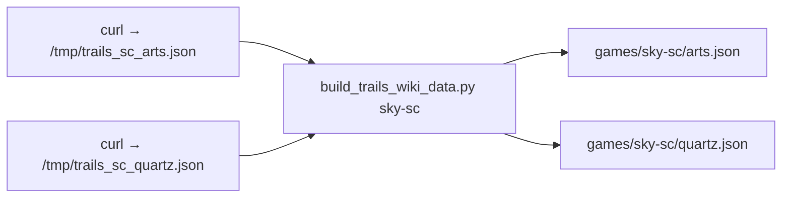

# Trails static data & orbment planner — comprehensive plan

This document is the **single canonical spec** for the repo. **§1–§7** define goals, layout, JSON schemas, UI, wiki build, and verification. **§4** and **§6** are the authoritative homes for roster data and quartz **`type`** / parser rules—avoid duplicating them in §8. **§8** is a short implementation history and clarifications that do not fit the original Cursor plans. **§9** maps archived plan filenames (under `~/.cursor/plans/`) to sections. **§10** is a compact index.

---

## 1. Goals and constraints

- **Stack:** Vanilla HTML, JavaScript, and CSS only (no bundler or framework required to run the site).
- **Data:** Per-title JSON under `games/{id}/`: `characters.json`, `quartz.json`, `arts.json`.
- **UI:** Root orbment planner: pick game and character, assign quartz to slots, see line sepith totals and derived features (enabled arts, quartz-type rules).
- **Serving:** Browsers restrict `fetch()` on `file://`. Serve the repo root with a static HTTP server (for example `python3 -m http.server`) and open `http://localhost:PORT/` so URLs like **`games/{id}/characters.json`** resolve relative to the page. **[`app.js`](app.js)** uses these **relative** paths so **GitHub Pages** project sites (`https://<user>.github.io/<repo>/`) work: `fetch` must not use a leading **`/`** (which would skip the repo path segment). Publish from the repo root or **`/docs`** with the same layout (`index.html` beside **`games/`**).

---

## 2. Repository layout (current)

```text
trails/
  games/
    sky-fc/      characters.json, quartz.json, arts.json
    sky-sc/
    sky-tc/
    zero/
  index.html
  app.js
  styles.css
  scripts/
    build_trails_wiki_data.py
```

(Original static plan counted **four** title directories × **three** JSON files; the same twelve logical files now sit under `games/{id}/` after relocation.)

**Relocation (completed):** Game folders live under `games/`, not at the repo root. The app loads JSON via **relative** URLs **`games/{gameId}/...`** (resolved from the published directory that contains [`index.html`](index.html)). The wiki rebuild script writes under `games/{id}/` for the chosen id: **`sky-fc`**, **`sky-sc`**, **`sky-tc`**, or **`zero`** (see §6.3–§6.6).

**Checklist (from relocation plan):** (1) Create `games/` at repo root. (2) Move `sky-fc`, `sky-sc`, `sky-tc`, `zero` into `games/` with a single `mv` (preserve contents). (3) In [`app.js`](app.js), use **`games/`**-relative fetches (not root-absolute **`/games/`**—§1 **Serving**). (4) Point [`scripts/build_trails_wiki_data.py`](scripts/build_trails_wiki_data.py) outputs at `games/{id}/`. (5) Smoke-test with `python3 -m http.server` and open **`games/sky-fc/characters.json`** (or pick a game) plus the orbment UI.

---

## 3. Game selector

| Label | `value` (directory id) |
|-------|-------------------------|
| Sky FC | `sky-fc` |
| Sky SC | `sky-sc` |
| Sky the 3rd | `sky-tc` |
| Trails from Zero | `zero` |

On change: load `characters.json`, `quartz.json`, and `arts.json` for that id in parallel (paths **`games/{id}/…`** relative to the site). Characters and quartz are required for a successful load; if `arts.json` is missing or non-OK, `artsList` becomes `[]` and the enabled-arts table shows the empty state. Reset character selection and dependent UI until new data arrives.

---

## 4. JSON file layout and initial content

Inside **each** of the four `games/{id}/` directories:

| File | Initial / current intent |
|------|---------------------------|
| `characters.json` | **`sky-fc`:** seeded Sky FC party (**eight** characters, **six** slots each; §4.1 table). **`sky-sc`:** **ten** characters, **seven** slots each in [`games/sky-sc/characters.json`](games/sky-sc/characters.json). **`sky-tc`:** **sixteen** characters, **seven** slots each in [`games/sky-tc/characters.json`](games/sky-tc/characters.json) (Sky the 3rd party roster). **`zero`:** **four** characters, **seven** slots each in [`games/zero/characters.json`](games/zero/characters.json) (Trails from Zero core party; §4.1). **Array order:** checked-in **`sky-fc`**, **`sky-sc`**, **`sky-tc`**, and **`zero`** rosters are stored **alphabetically by `name`** (case-insensitive), matching `sort_characters_for_output` in [`scripts/build_trails_wiki_data.py`](scripts/build_trails_wiki_data.py) and the **`--resort-json-only`** path (§6.3). If you intentionally use story or party order, either skip resorting `characters.json` or restore order after `--resort-json-only`. |
| `quartz.json` | Array of quartz objects; **`sky-fc`**, **`sky-sc`**, **`sky-tc`**, and **`zero`** populated from their Fandom wiki lists via [`scripts/build_trails_wiki_data.py`](scripts/build_trails_wiki_data.py). Future titles may be `[]` until wired to the script. |
| `arts.json` | Array of art objects; **`sky-fc`**, **`sky-sc`**, **`sky-tc`**, and **`zero`** from wiki. Others may be `[]` until populated. |

All files must remain valid JSON.

### 4.1 `characters.json` schema

Each array element:

- `name` (string)
- `guest` (boolean) — `false` for permanent party members; `true` for temporary/guest characters. All existing characters shipped with `"guest": false`. The UI hides guest characters by default (§5.1).
- `orbment` (array of objects), each with:
  - `elemental` (`string` or `null`) — lowercase element keyword (`earth`, `water`, `fire`, `wind`, `time`, `space`, `mirage`) or `null` when the slot has no elemental restriction.
  - `line` (int) — line grouping for totals; `0` and negative values follow the aggregation rules in §5.

**Sky FC roster:** Eight party members, each with six slots. Authoritative values are in [`games/sky-fc/characters.json`](games/sky-fc/characters.json). The file’s **array order** is **alphabetical by `name`** (Agate Crosner … Zin Vathek)—not the narrative table order below. Summary table (slot index order 0–5):

| Character | `elemental` by slot 0–5 | `line` by slot 0–5 |
|-----------|-------------------------|---------------------|
| Estelle Bright | all `null` | `0, 1, 1, 1, 2, 2` |
| Joshua Astray | `time`, `null`, `null`, `time`, `null`, `null` | `0, 1, 1, 1, 1, 2` |
| Scherazard Harvey | `wind`, `null`, `null`, `null`, `wind`, `null` | `0, 1, 2, 2, 2, 2` |
| Olivier Lenheim | `mirage`, `null`, `null`, `null`, `null`, `null` | `0, 1, 1, 1, 1, 1` |
| Kloe Rinz | `water`, `water`, `null`, `water`, `null`, `null` | `0, 1, 1, 1, 1, 1` |
| Agate Crosner | `fire`, `null`, `null`, `null`, `null`, `fire` | `0, 1, 1, 2, 3, 3` |
| Tita Russell | `space`, `null`, `null`, `space`, `null`, `null` | `0, 1, 2, 2, 2, 3` |
| Zin Vathek | `earth`, `null`, `null`, `null`, `null`, `earth` | `0, 1, 1, 2, 3, 4` |

**Sky SC roster (current):** [`games/sky-sc/characters.json`](games/sky-sc/characters.json) defines **ten** party members with **seven** orbment slots each (slot count is **not** six like FC). **JSON array order** is **alphabetical by `name`** (case-insensitive): Agate Crosner, Estelle Bright, Josette Capua, **Joshua Bright** (SC uses this surname; FC §4.1 still lists **Joshua Astray**), Kevin Graham, Kloe Rinz, Olivier Lenheim, Scherazard Harvey, Tita Russell, Zin Vathek. Lines include **`4`** on some characters, so §5.5 line-tint classes through `quartz-slot-line-4` apply. **Post-seeding edits (authoritative in JSON):** **Tita Russell**—**space**-restricted slots on indices **0** and **3** (pattern `space`, `null`, `null`, `space`, …); **Scherazard Harvey**—slot **`line`** sequence **`0, 2, 2, 2, 2, 2, 1`**. There is no full per-slot table here—use the JSON as authoritative.

**Sky the 3rd (`sky-tc`) roster (current):** [`games/sky-tc/characters.json`](games/sky-tc/characters.json) lists **sixteen** playable entries with **seven** slots each. **JSON array order** is **alphabetical by `name`**: Agate Crosner, Alan Richard, Anelace Elfead, Estelle Bright, Josette Capua, Joshua Bright, Julia Schwarz, Kevin Graham, Kloe Rinz, Mueller Vander, Olivier Lenheim, Renne, Ries Argent, Scherazard Harvey, Tita Russell, Zin Vathek. **Post-seeding edits (authoritative in JSON):** **Tita Russell** matches SC’s **space** / **`null`** pattern above; **Scherazard Harvey** uses the same **`line`** pattern as SC (**0, 2, 2, 2, 2, 2, 1**); **Alan Richard**—slot **`line`** sequence **`0, 2, 2, 1, 2, 2, 2`**. All other `elemental` / `line` values per slot are only in that file.

**Trails from Zero (`zero`) roster (current):** [`games/zero/characters.json`](games/zero/characters.json) lists **seven** entries with **seven** slots each. **Four core members** (`guest: false`): **Elie MacDowell** (**wind** on slots **0** and **4**; **`line`** `0, 1, 1, 1, 1, 1, 2`), **Lloyd Bannings** (all **`null`** elementals; **`line`** `0, 1, 1, 1, 2, 2, 2`), **Randy Orlando** (**fire** slot **0**; **`line`** `0, 1, 1, 1, 2, 2, 3`), **Tio Plato** (**water** on slots **0** and **4**; **`line`** `0, 1, 1, 1, 1, 1, 1`). **Three guest members** (`guest: true`): **Alex Dudley** (**time** slot **0**; **`line`** `0, 1, 1, 1, 1, 2, 2`), **Noel Seeker** (**earth** slot **0**; **`line`** `0, 1, 1, 1, 2, 3, 4`), **Yin** (**mirage** slot **0**; **`line`** `0, 1, 1, 1, 1, 2, 3`). **JSON array order** is **alphabetical by `name`** (§4, §6.3): Elie, Lloyd, Randy, Tio, then Alex Dudley, Noel Seeker, Yin. Full slot data remains in the file.

### 4.2 `quartz.json` schema

Each element:

- `name` (string)
- `type` (int) — logical quartz family for UI rules (see §6: wiki import assigns types by name group and compacts to `1..N` without gaps).
- `elemental` (string) — primary element keyword (same vocabulary as `cost` keys).
- `cost` (object) — integer per element: `earth`, `water`, `fire`, `wind`, `time`, `space`, `mirage`.
- `effect` (string)
- `level` (int)

### 4.3 `arts.json` schema

Each element:

- `name` (string)
- `description` (string)
- `elemental` (string)
- `elemental-value` (object) — integer counts per element (same seven keys as `quartz.cost`).
- `cost` (int) — EP cost
- `time` (object) — `cast` and `delay` in AT units (distinct from the `time` element key under `elemental-value`).
- `power` (int)
- `target-effect` (string)

---

## 5. Root UI behavior

Files: [`index.html`](index.html), [`app.js`](app.js), [`styles.css`](styles.css).

### 5.1 Character selector

Populate from `character.name`. If `characters.json` is `[]`, disable the control or show a clear empty state.

**Guest character filtering:** A **"Show guest characters"** checkbox sits beside the character `<select>`. When **unchecked** (default), only characters with `guest !== true` appear in the dropdown. When **checked**, all characters are shown. Implemented via `populateCharacterDropdown()` in [`app.js`](app.js), which filters by `showGuestCheckbox.checked` and is called from both `onGameChange` and the checkbox `change` handler. If the currently selected character becomes hidden when the checkbox is unchecked (i.e. it was a guest), the character panel is cleared. If the current selection remains visible after the checkbox changes, the panel stays open. The checkbox state is not persisted across game changes.

### 5.2 Orbment slot table (three columns)

One row per `character.orbment` entry (index = slot index). Row count follows `orbment.length` (**six** for Sky FC; **seven** for **`sky-sc`**, **`sky-tc`**, and **`zero`**). Markup: [`index.html`](index.html) `#orbment-slots` (`<thead>`: Elemental, Quartz, Effect).

| Column | Content |
|--------|---------|
| **Elemental** | If `slot.elemental` is set, show the label with elemental styling (CSS classes such as `.elemental-earth`). If `null`, show a neutral placeholder (for example `—`). |
| **Quartz** | `<select>` of quartz filtered by slot: if `slot.elemental` is a string, only quartz with matching `elemental`; if `null`, all quartz from loaded `quartz.json`. Blank option for no quartz. **Implemented:** distinct `type` per slot — the same quartz `type` cannot be selected in two slots except by name for **Heal** and **Yin-Yang** (see `QUARTZ_ALLOW_DUPLICATE_ACROSS_SLOTS` in [`app.js`](app.js)); other conflicts resolve by keeping an earlier selection and clearing later ones. **Implemented:** quartz `<td>` background reflects slot `line` using the same CSS line classes as the line totals table (**§5.5**). **Implemented:** each `<option>` (except the blank row) carries classes **`quartz-option`** + the same elemental token as **`elementalClass`** in [`app.js`](app.js) (e.g. **`elemental-water`**); [`styles.css`](styles.css) sets **`select option.quartz-option.*`** backgrounds to match the elemental column palette. Native **`<option>`** styling is inconsistent on **Safari** and some OS menus—Chromium/Firefox show colours most reliably. Optional **`title`** on options repeats the quartz **`effect`** for hover where supported. The `<select>` uses **`width: 100%`** inside the quartz column (overrides the global **`select { min-width: 16rem }`** for this table only). |
| **Effect** | Read-only cell showing the **`effect`** string of the quartz currently selected in that row’s `<select>` (updated in **`updateQuartzEffectCells`** from [`app.js`](app.js)); **`—`** when no quartz is selected. CSS class **`quartz-effect-cell`** (wrap long text). |

**Column widths (`#orbment-slots` in [`styles.css`](styles.css)):** **`table-layout: fixed`**, **`width: 100%`**. First column (elemental): **200px** fixed (`width` / `min-width` / `max-width`, **`box-sizing: border-box`** on orbment cells). Second and third columns (**Quartz**, **Effect**): equal share of the remainder, each **`width: calc((100% - 200px) / 2)`**.

**Elemental palette (illustrative):** earth brown, water blue, wind green, fire red, time black, space gold, mirage light grey — tuned for contrast in [`styles.css`](styles.css) (space and mirage colours are swapped vs the earliest static-plan wording).

### 5.3 Line totals table

- **Columns:** `Line`, then the seven elements in fixed order: `earth`, `water`, `fire`, `wind`, `time`, `space`, `mirage`.
- **Rows:** One row per distinct positive `line` among `character.orbment[].line`, sorted ascending. If none exist, follow the original edge-case behavior (aggregate row for line `0` / “All lines” when slots on line `0` or negative lines contribute).

**Recalculation:** For each slot with selected quartz `Q` and line `L`:

1. **`L > 0`:** add `Q.cost` to the row for line `L`.
2. **`L === 0` or `L < 0`:** add `Q.cost` to every positive-line row; if there are no such rows, add to a single aggregate row so shared slots still contribute.

Rebuild from scratch on each change (simplest correct model).

### 5.4 Enabled arts table (implemented)

After line totals, the UI lists **arts** from `arts.json` that are **unlockable on at least one line** under the current quartz picks. For each positive line `L`, the sepith row `totals[L]` must satisfy `totals[L][e] >= art["elemental-value"][e]` for every element `e` (see `rowMeetsElementalRequirement` in [`app.js`](app.js)). If the character has **no** positive line groups, the same check is applied once to the **aggregate** row (line `0` / “all lines”). An art appears in the table with a **Lines** column listing every line (or `0` in the aggregate-only case) on which it is enabled—this is **not** “sum all columns then compare once”; each line is evaluated independently, which matches in-game line-based orbment logic.

### 5.5 Line and elemental styling (merged *Colours and orbment roster* plan)

Implemented in [`styles.css`](styles.css) and driven by slot `line` in [`app.js`](app.js) via `quartzLineClass(line)` (classes on the quartz `<td>` and on matching **line totals** `<tr>` rows).

**Space vs mirage elemental cells:** `.elemental-space` and `.elemental-mirage` intentionally **swap** the palettes that older static-plan prose described as “space = light grey, mirage = gold”: space uses the gold-toned background, mirage the light grey (`elementalClass` in `app.js` is unchanged).

**Line background colours** (only for **positive** line ids `1`–`4`; line `0`, negative lines, and any `line` outside `1..4` get **no** line tint—`quartzLineClass` returns `""`):

| CSS class | Slot `line` value | Background (canonical) |
|-----------|---------------------|-------------------------|
| `quartz-slot-line-1` | `1` | Light brown (`#deb887`) |
| `quartz-slot-line-2` | `2` | `lightblue` |
| `quartz-slot-line-3` | `3` | `lightgreen` |
| `quartz-slot-line-4` | `4` | Light red (`#ffb3b3`) |

Quartz `<select>` elements inside tinted cells use a semi-transparent white background so text stays readable. Orbment **`<option>`** elemental colours reuse the same hue system (**§5.2**).

**Roster changes from that plan:** Six FC party members’ `orbment` `elemental` / `line` slots were revised; **Zane Vathek** was renamed **Zin Vathek**. Authoritative **FC** slot data is §4.1 and [`games/sky-fc/characters.json`](games/sky-fc/characters.json). **SC** no longer mirrors that eight-by-six table: see **§4.1** (Sky SC roster paragraph) and [`games/sky-sc/characters.json`](games/sky-sc/characters.json).

---

## 6. Wiki-backed data and build script

### 6.1 Sources and attribution

Wiki text may be CC-BY-SA; if you copy effect or description prose verbatim, keep [appropriate Fandom licensing / attribution](https://www.fandom.com/licensing).

| Game | Arts page | Quartz page |
|------|-----------|---------------|
| Sky FC | [List of orbal arts (Sky FC)](https://kiseki.fandom.com/wiki/List_of_orbal_arts_(Sky_FC)) | [List of quartz (Sky FC)](https://kiseki.fandom.com/wiki/List_of_quartz_(Sky_FC)) |
| Sky SC | [List of orbal arts (Sky SC)](https://kiseki.fandom.com/wiki/List_of_orbal_arts_(Sky_SC)) | [List of quartz (Sky SC)](https://kiseki.fandom.com/wiki/List_of_quartz_(Sky_SC)) |
| Sky the 3rd | [List of orbal arts (Sky 3rd)](https://kiseki.fandom.com/wiki/List_of_orbal_arts_(Sky_3rd)) | [List of quartz (Sky 3rd)](https://kiseki.fandom.com/wiki/List_of_quartz_(Sky_3rd)) |
| Trails from Zero | [List of orbal arts (Zero)](https://kiseki.fandom.com/wiki/List_of_orbal_arts_(Zero)) | [List of quartz (Zero)](https://kiseki.fandom.com/wiki/List_of_quartz_(Zero)) |

**Scope (original static plan):** Include **one JSON object per row** for every qualifying wikitable body row on the target page (section tables may repeat headers—each body row is still one entry). Arts: every data row in offensive/support subsection tables. Quartz: every row in tables that expose the needed columns.

### 6.2 Wiki column → JSON field mapping (authoritative tables)

These tables reproduce the **Trails static data layout** plan; on-disk paths are now under `games/sky-fc/` (or `games/sky-sc/` for SC pages).

**`quartz.json` (wiki row → object)** — FC-style column semantics; SC adds an extra column (§6.5).

| `quartz.json` field | Wiki source / rule |
|---------------------|---------------------|
| `name` | **Name** column: primary English name (bold); optionally strip Japanese line for English-only `name`. |
| `type` | **Not on the wiki.** Assigned in the build script (name groups, status merge including **Burn** / **Burn 2** with **Poison**, **Effort**/**Prankster** merge, SC gem aliases, **Carnage** alias, then compaction)—see §6.4 and **`post_process_quartz_types`** in [`scripts/build_trails_wiki_data.py`](scripts/build_trails_wiki_data.py). |
| `elemental` | Row’s **element / quartz icon** (`alt`, or filename/URL if `alt` empty). Normalize to `earth` … `mirage`. |
| `cost` | **Elemental Value** column only: sepith icons and `×N` multipliers into the seven-int `cost` object, left-to-right (same spirit as arts `elemental-value`). **Not** synthesis cost for shipped JSON. |
| `effect` | **Effect** column; merge continuation lines if the cell splits across rows. |
| `level` | **Not in Sky FC/SC wiki tables as a column.** Stored as **`1`** as a fixed placeholder. |

**`arts.json` (wiki row → object)**

| `arts.json` field | Wiki source / rule |
|-------------------|---------------------|
| `name` | **Name** column: primary English (bold, e.g. **Stone Hammer**); optionally omit Japanese line. |
| `description` | Lines after the main row for that art (type line + flavor), merged until the next art’s main row. |
| `elemental` | First column icon: `alt` or infer from image URL/filename → lowercase element keyword. |
| `elemental-value` | **Elemental Value** column: each sepith icon with `×N`; chains like `×3×2` pair left-to-right with successive icons. |
| `cost` | **Cost** column: numeric EP only (`10 EP` → `10`). |
| `time` | **Time** column: `Cast: … AT` and `Delay: … AT` → integers. |
| `power` | **Power** column; `—` → `0`. |
| `target-effect` | **Targets/Effect** column; merge wrapped lines until the art block ends. |

### 6.3 Parser implementation ([`scripts/build_trails_wiki_data.py`](scripts/build_trails_wiki_data.py))

- Reads **cached** MediaWiki `action=parse&prop=text` JSON (no live HTTP inside the script). Input paths are in `GAME_INPUTS`: `/tmp/trails_fc_*.json` for **`sky-fc`**, `/tmp/trails_sc_*.json` for **`sky-sc`**, `/tmp/trails_tc_*.json` for **`sky-tc`**, `/tmp/trails_zero_*.json` for **`zero`** (Sky trilogy keys use **`trails_fc_*`** / **`trails_sc_*`** / **`trails_tc_*`** filenames in `/tmp` by historical convention).
- Wiki import **requires** a positional game id (no default). **`python3 scripts/build_trails_wiki_data.py sky-fc`** → `games/sky-fc/`. **`… sky-sc`** → `games/sky-sc/`. **`… sky-tc`** → `games/sky-tc/`. **`… zero`** → `games/zero/`.
- **Output order:** Before writing `arts.json` / `quartz.json`, the script sorts **arts** by `elemental` (canonical order `earth` … `mirage` as in `ELEMENTS`), then **`target-effect`**, then **`cost`** (EP). **Quartz** by `elemental` (same order), then **`type`**. To re-sort on-disk JSON for every game without re-fetching the wiki: **`python3 scripts/build_trails_wiki_data.py --resort-json-only`** — rewrites **`arts.json`**, **`quartz.json`**, and non-empty **`characters.json`** under **`games/{sky-fc,sky-sc,sky-tc,zero}/`** using the same sort keys as a normal build (`sort_arts_for_output`, `sort_quartz_for_output`, **`sort_characters_for_output`** — characters by **`name`** with **`.casefold()`**). Checked-in **`sky-fc` / `sky-sc` / `sky-tc` / `zero`** rosters already match that order. If you add characters in **non-alphabetical** order (e.g. story order), a full **`--resort-json-only`** run will **reorder** them—restore manually or avoid resort until you accept alphabetical storage. To **recompute only quartz `type` ids** from the rules in §6.4 (no wiki): **`python3 scripts/build_trails_wiki_data.py --reassign-quartz-types-only`**.
- Parses `class="article-table"` with BeautifulSoup; dependencies under [`.build_deps/`](.build_deps/) (gitignored); script prepends that path to `sys.path`.
- **Arts:** Expects `rowspan="2"` on the first two `<td>` cells of a seven-column data row, plus a continuation row for description/target merge (FC and SC share this shape; SC yields on the order of **73** arts).
- **Elemental value cells:** Prefer `span` nodes with `style` containing `nowrap`, pairing `img` alts with digit runs; fallback scans all images and digits in the cell.
- **Quartz table filter:** Header row (joined, case-insensitive) must include both **`elemental value`** and **`synthesis cost`**.
- **FC vs SC quartz rows:** Both wiki versions can mention **Location** in the header. **FC** has **six** header cells and six body `<td>` per row. **Sky SC** has **seven** (extra **slot upgrade** column after the quartz element icon). The script selects SC mode when **`len(header_cells) >= 7`**, not when the substring `"location"` appears in the header text—FC’s six-column tables also include “Location” and incorrectly routing them through the SC parser produced **zero** FC quartz until this rule was fixed. SC body mapping: col **0** elemental icon, col **1** slot upgrade **ignored**, cols **2–4** name / effect / elemental value (`cost`), synthesis and location columns discarded for JSON.

### 6.4 Quartz `type` assignment (post-import)

1. **Name groups:** Same stem + trailing tier digit (e.g. `Defense 1` … `Defense 4`) share one `type`; first-seen stem order assigns provisional ids.
2. **Poison-group quartz:** Poison, Mute, Petrify, Freeze, Seal, Confuse, Sleep, Blind, **Strike**, **Death**, **Deathblow 1**, **Deathblow 2**, **Nothingness**, **Burn**, and **Burn 2** share Poison’s `type` when Poison exists (`STATUS_QUARTZ_NAMES` in [`scripts/build_trails_wiki_data.py`](scripts/build_trails_wiki_data.py)).
3. **Effort / Prankster:** **`assign_effort_prankster_shared_type`** gives **Effort** and **Prankster** the same `type` (Crossbell-era cooking quartz; uses **Effort**’s provisional type when both rows exist).
4. **Sky SC tier gems:** Gems are separate wiki rows but match a stat line’s final tier in-game. After (1)–(3), **`assign_gem_type_aliases`** copies the `type` from a representative row of that line (same group as “Defense 5”, etc.):

| Gem name | `type` aligned with row (representative in script) |
|----------|------------------------------------------------------|
| Topaz Gem | Defense 1 (Defense family) |
| Water Gem | HP 1 |
| Sapphire Gem | Mind 1 |
| Ruby Gem | Attack 1 |
| Emerald Gem | Shield 1 |
| Wind Gem | Evade 1 |
| Wood Gem | Impede 1 |
| Onyx Gem | Action 1 |
| Time Gem | Cast 1 (SC wiki dump has Cast 1–2 only; same **Cast** group as “Cast 3”) |
| Gold Gem | EP Cut 1 |
| Silver Gem | EP 1 |
| Mirage Gem | Hit 1 |

Constants live in `GEM_TYPE_SOURCE_NAME` in the build script.

5. **Carnage (Sky the 3rd wiki):** After gem aliases, **`assign_carnage_attack_alias`** gives **Carnage** the same `type` as **Attack 6** when that row exists in the parse; otherwise it walks **Attack 5** … **Attack 1** (`CARNAGE_ATTACK_SOURCES`) and uses the first match so Carnage always joins the Attack tier family (treat as logical **Attack 6** for exclusivity when the wiki omits higher tiers).

6. **Compaction:** Remap distinct type ids to contiguous `1..N` with no gaps.

### 6.5 Sky SC data policy (merged SC plan)

- **Characters:** [`games/sky-sc/characters.json`](games/sky-sc/characters.json) is a **ten-character, seven-slot** SC orbment roster (names in **alphabetical** JSON order—§4.1); it is **not** an FC roster copy. See §4.1.
- **Arts / quartz:** Generated from the SC wiki pages in §6.1 using the same arts parser as FC and the quartz rules in §6.3–6.4.
- **Verification hints:** Expect about **73** arts and **95** quartz rows from current parses; spot-check SC quartz **elemental value** (parser column for `cost`) vs synthesis column on the wiki.

### 6.6 Regenerating wiki JSON (curl + Python)

From the repo root, with network access. Adjust `/tmp` paths in `GAME_INPUTS` in the script if you prefer another cache location. **Historical note:** older docs and shells used **`/tmp/sky_*`** filenames; the repo now standardizes on **`/tmp/trails_*`** (must match `GAME_INPUTS` in [`scripts/build_trails_wiki_data.py`](scripts/build_trails_wiki_data.py)). **Wiki import** always passes an explicit game id on the command line (`sky-fc`, `sky-sc`, `sky-tc`, or `zero`); bare `python3 scripts/build_trails_wiki_data.py` with no positional argument exits with a usage error.

**Sky FC (`sky-fc`):**

```bash
curl -sL "https://kiseki.fandom.com/api.php?action=parse&page=List_of_orbal_arts_(Sky_FC)&format=json&prop=text" -o /tmp/trails_fc_arts.json
curl -sL "https://kiseki.fandom.com/api.php?action=parse&page=List_of_quartz_(Sky_FC)&format=json&prop=text" -o /tmp/trails_fc_quartz.json
python3 scripts/build_trails_wiki_data.py sky-fc
```

**Sky SC (`sky-sc`):**

```bash
curl -sL "https://kiseki.fandom.com/api.php?action=parse&page=List_of_orbal_arts_(Sky_SC)&format=json&prop=text" -o /tmp/trails_sc_arts.json
curl -sL "https://kiseki.fandom.com/api.php?action=parse&page=List_of_quartz_(Sky_SC)&format=json&prop=text" -o /tmp/trails_sc_quartz.json
python3 scripts/build_trails_wiki_data.py sky-sc
```

**Sky the 3rd (`sky-tc`):**

```bash
curl -sL "https://kiseki.fandom.com/api.php?action=parse&page=List_of_orbal_arts_(Sky_3rd)&format=json&prop=text" -o /tmp/trails_tc_arts.json
curl -sL "https://kiseki.fandom.com/api.php?action=parse&page=List_of_quartz_(Sky_3rd)&format=json&prop=text" -o /tmp/trails_tc_quartz.json
python3 scripts/build_trails_wiki_data.py sky-tc
```

**Trails from Zero (`zero`):**

```bash
curl -sL "https://kiseki.fandom.com/api.php?action=parse&page=List_of_orbal_arts_(Zero)&format=json&prop=text" -o /tmp/trails_zero_arts.json
curl -sL "https://kiseki.fandom.com/api.php?action=parse&page=List_of_quartz_(Zero)&format=json&prop=text" -o /tmp/trails_zero_quartz.json
python3 scripts/build_trails_wiki_data.py zero
```

If either cached file for the chosen game is missing, the script exits with an error. `PYTHONPATH=.build_deps` is optional because the script inserts `.build_deps` on `sys.path`.

**SC data flow** (from archived SC plan diagram):



---

## 7. Verification checklist

- **Layout:** Under `games/`, each title has the three JSON files. Titles **`sky-fc`**, **`sky-sc`**, **`sky-tc`**, and **`zero`** ship wiki-backed `arts.json` / `quartz.json` where the build has been run; **`sky-sc`**, **`sky-tc`**, and **`zero`** have populated seven-slot rosters (§4.1).
- **Fetch paths:** UI requests **`games/{id}/characters.json`**, **`games/{id}/quartz.json`**, and **`games/{id}/arts.json`** (relative URLs—§1 **Serving**, GitHub Pages–compatible).
- **`games/sky-fc/characters.json`:** Eight entries, six slots each, matching the roster table in §4.1.
- **`games/sky-sc/characters.json`:** Ten entries, seven `orbment` slots each; matches §4.1 SC roster paragraph (not the FC eight-by-six table). Entries are **alphabetical by `name`** (§4, §6.3).
- **`games/sky-tc/characters.json`:** Sixteen entries, seven slots each; §4.1 Sky the 3rd roster paragraph (alphabetical **`name`** order in JSON).
- **`games/zero/characters.json`:** Seven entries, seven slots each; §4.1 Trails from Zero roster paragraph. Four core members (`guest: false`) + three guest members (`guest: true`): Alex Dudley, Noel Seeker, Yin. Alphabetical **`name`** order.
- **`games/sky-sc`** wiki rows: After §6.6, expect on the order of **73** arts and **95** quartz; spot-check SC quartz **elemental value** (what becomes `cost`) vs the wiki’s synthesis column (which JSON omits).
- **Wiki data:** Spot-check random arts and quartz rows against the wiki (names, EP, cast/delay, sepith columns, effects).
- **Quartz types:** After regeneration, types are dense `1..N`; tier gems share types with their stat lines (§6.4). After changing exclusivity rules in the build script, run **`python3 scripts/build_trails_wiki_data.py --reassign-quartz-types-only`** (or a full wiki rebuild) so every **`games/*/quartz.json`** picks up merged types; spot-check **`zero`** for **Poison** vs **Burn**, and **Effort** vs **Prankster** (§6.4).
- **Manual UI pass:** With a local server, select `sky-fc` and `sky-sc`, assign quartz, confirm line totals, distinct-type behavior (plus **Heal** / **Yin-Yang** allowed in multiple slots—§5.2), and enabled arts **per line** against hand-calculated totals. Confirm **Effect** column text matches selected quartz **`effect`** in JSON; **`#orbment-slots`** column widths (200px + two equal halves) and quartz **`<select>`** full width inside the quartz column (§5.2).
- **Build:** After curl + `build_trails_wiki_data.py sky-sc` (or another id), confirm printed counts (§8.2) and spot-check types.
- **Colours / roster:** After changing [`styles.css`](styles.css) or character JSON, reload the UI: elemental **space** vs **mirage** columns should match §5.5; line-tinted slots and line-total rows should match §5.5 for lines `1`–`4`; character dropdown lists **Zin Vathek** (not Zane).

---

## 8. Implementation history and conversational context

This section captures **agent/session context** that does not belong in the original Cursor plan markdown files: how the repo was built, what was debugged, and where behavior intentionally diverges from an ambiguous reading of the prose specs.

### 8.1 Chronology (high level)

1. **Foundation:** Static **`sky-fc`**, **`sky-sc`**, **`sky-tc`**, and **`zero`** folders with JSON; root orbment UI (`index.html`, `app.js`, `styles.css`). Wiki-backed **`sky-fc`** arts/quartz via cached MediaWiki JSON + BeautifulSoup in [`scripts/build_trails_wiki_data.py`](scripts/build_trails_wiki_data.py) (quartz table filter, arts `elemental-value` parsing, real **`type`** ids). This document merged the original Cursor plans; script uses `Optional[str]` for older Python.

2. **`games/` relocation:** Title dirs under `games/`; app **`fetch`** uses **relative** `games/{id}/…` (GitHub Pages–safe); script writes `games/{id}/`.

3. **SC wiki + roster:** SC arts/quartz import; **`sky-sc`** CLI and `GAME_INPUTS`; dedicated **ten×seven** [`games/sky-sc/characters.json`](games/sky-sc/characters.json) (alphabetical **`name`** order—§4.1, §6.3). FC vs SC quartz tables disambiguated by **seven** header cells (§6.3).

4. **`sky-tc` / `zero` wiki:** Extended `GAME_INPUTS`, §6.1 URLs, §6.6 `curl` blocks, same parsers/`post_process_quartz_types` as FC/SC. **`sky-tc`** and **`zero`** `characters.json` populated.

5. **Hand-maintained orbments:** Post-seed **`elemental`** / **`line`** for **Tita**, **Scherazard** (SC + Sky the 3rd), **Alan Richard** (Sky the 3rd only)—§4.1; wiki script only refreshes arts/quartz for those files.

6. **Quartz exclusivity (script):** `STATUS_QUARTZ_NAMES` (incl. Death, Nothingness, Burn/Burn2), Effort/Prankster merge, tier **gems**, **Carnage** alias, **`compact_quartz_types`**; script renamed from `build_fc_wiki_data.py`; **`/tmp/trails_*`** caches; **`--resort-json-only`** and **`--reassign-quartz-types-only`**—all in **§6.3–§6.4**.

7. **Planner UI:** Line-tinted quartz column and line totals; **distinct `type` per slot** + conflict resolution; **enabled arts** table; **Heal** / **Yin-Yang** multi-slot (**§5.2**, §8.3). **Effect** column, elemental **`<option>`** styling, **`#orbment-slots`** widths—**§5.2**.

8. **Colours / FC roster copy:** Space/mirage palette swap; line **`1`–`4`** tints; six FC orbments + **Zin** rename—**§5.5**, §4.1.

9. **Guest character support:** Added `guest` boolean field (default `false`) to all characters across all four games (§4.1 schema). Added "Show guest characters" checkbox to the UI (§5.1); `populateCharacterDropdown()` extracted from `onGameChange` to support filtering. Added three guest characters to **`zero`**: Alex Dudley, Noel Seeker, Yin (`guest: true`)—§4.1.

### 8.2 Current wiki-backed data counts

As produced by the wiki pipeline (verify anytime with `len()` on the JSON arrays). Counts below were checked against the repo’s on-disk files; re-run **`len(json.load(...))`** after regeneration if numbers drift:

| File | Approximate row count |
|------|-------------------------|
| [`games/sky-fc/arts.json`](games/sky-fc/arts.json) | 43 arts |
| [`games/sky-fc/quartz.json`](games/sky-fc/quartz.json) | 56 quartz |
| [`games/sky-sc/arts.json`](games/sky-sc/arts.json) | 73 arts |
| [`games/sky-sc/quartz.json`](games/sky-sc/quartz.json) | 95 quartz |
| [`games/sky-tc/arts.json`](games/sky-tc/arts.json) | 82 arts |
| [`games/sky-tc/quartz.json`](games/sky-tc/quartz.json) | 111 quartz |
| [`games/zero/arts.json`](games/zero/arts.json) | 58 arts |
| [`games/zero/quartz.json`](games/zero/quartz.json) | 77 quartz |

Roster intent and per-title **`characters.json`** details: **§4.1** (not repeated here).

### 8.3 Client UI code anchors ([`app.js`](app.js))

| Concern | Functions / notes |
|---------|-------------------|
| Quartz exclusivity by `type` | `usedTypesExceptSlot`, `resolveConflictingSelections`, `quartzAllowsDuplicateAcrossSlots` / `QUARTZ_ALLOW_DUPLICATE_ACROSS_SLOTS` (Heal, Yin-Yang); options filtered inside `refreshAllQuartzSelects` |
| Orbment effect column | `updateQuartzEffectCells` — reads each `quartz-slot-{i}` value, writes selected quartz **`effect`** into `#quartz-effect-{i}`; called from `refreshAllQuartzSelects` before `recalcLineTotals` |
| Line totals + aggregate | `distinctPositiveLines`, `computeLineSepithTotals`, `recalcLineTotals` |
| Enabled arts | `rowMeetsElementalRequirement`, `enablingLinesForArt`, `renderEnabledArtsTable` (invoked at end of `recalcLineTotals`) |
| Line styling | `quartzLineClass` for quartz `<td>` and line-total rows; `elementalClass` for elemental cells and quartz `<option>` classes |
| Game load | `onGameChange` — `Promise.all` fetch to **`games/{id}/`** `characters.json`, `quartz.json`, `arts.json` (relative paths); calls `populateCharacterDropdown()` on success |
| Guest filtering | `populateCharacterDropdown` — filters `characters` array by `showGuestCheckbox.checked`; called from `onGameChange` and the checkbox `change` handler. Checkbox `change` handler restores the previous character selection if it remains visible after filtering. |

Slot `<select>` `change` handlers call `refreshAllQuartzSelects`, which rebuilds options (with **`quartz-option`** + elemental classes per option), calls **`updateQuartzEffectCells`**, then **`recalcLineTotals`** so totals and arts stay in sync.

### 8.4 Spec clarifications from implementation

- **Arts vs quartz:** Deliverables are both **`arts.json`** and **`quartz.json`** with the field shapes in **§4** (some early discussion conflated the two).
- **Enabled arts:** “Totals vs requirement” is **per-line** sufficiency, not one row summed across lines—**§5.4**.
- **Wiki `type` vs static plan:** The build script assigns compact **`type`** ids for exclusivity (not placeholder `0` for every row)—**§6.4**.
- **Quartz exclusivity rules:** Status group (Poison family incl. Death, Nothingness, Burn/Burn2), Effort/Prankster, gems, Carnage, **`post_process_quartz_types`**, **`--reassign-quartz-types-only`**—authoritative in **§6.3–§6.4**; regenerate **`quartz.json`** after script edits.
- **Heal / Yin-Yang:** Client **`name`** allowlist bypasses default one-**`type`**-per-loadout rule—**§5.2**, §8.3.
- **Paths and caches:** Data lives under **`games/{id}/…`**; wiki caches use **`/tmp/trails_*`** and **[`scripts/build_trails_wiki_data.py`](scripts/build_trails_wiki_data.py)**—**§6.3** (not `build_fc_wiki_data.py` / `sky_*`).
- **Hand rosters + sort order:** **`sky-sc` / `sky-tc` / `zero`** `characters.json` are edited in JSON; **`--resort-json-only`** sorts **`name`** alphabetically—**§4** table footnote, §6.3. §4.1 FC **table** order is narrative, not JSON array order.
- **Native `<option>` styling:** Elemental option backgrounds—**§5.2** (browser-dependent).

### 8.5 `index.html` expectations (from static layout plan)

Semantic shell: document title; `<select id="game">`; `<select id="character">` hidden or disabled until a game loads; **`#orbment-slots`** slot table with **three** header columns (**Elemental**, **Quartz**, **Effect**—§5.2); **`#line-totals`** (sepith totals); enabled-arts table and empty-state hooks as implemented in the repo; `<script src="app.js" defer>` and `<link rel="stylesheet" href="styles.css">`. Use `<label for="…">` on controls where cheap. **Serving note from that plan:** static server from project root; old example URL `/fc/characters.json` is superseded by **`games/sky-fc/characters.json`** relative to the published site (see §1 **Serving** for GitHub Pages).

### 8.6 Agent transcript reference

Design and tool history for this repo were consolidated from an extended Cursor agent session; local transcript id: [Trails static orbment work](0ff6ea76-e8f1-4799-9c42-a6af8c1a82b7).

---

## 9. Source plan index

Cursor stores plan markdown under `~/.cursor/plans/` (filenames include a short hash). This table maps them to what was merged here:

| Plan file (typical name) | Merged into |
|--------------------------|-------------|
| `trails_static_data_layout_*.plan.md` | §1–§5, §6.1–6.2 (column tables, scope), §8.5 |
| `move_game_dirs_under_games_*.plan.md` | §2 relocation checklist, §8.1 item 2 (original “out of scope”: no renames inside per-game JSON schemas) |
| `sc_data_from_wiki_*.plan.md` | §4 Sky SC roster rows, §6.1 (SC URLs), §6.3 (SC quartz rules), §6.4 (gems), §6.5, §6.6 (SC curl), §8.1 items 3 and 6 |
| `colours_and_orbment_roster_*.plan.md` | §5.5 (space/mirage + line `1`–`4` colours), §4.1 FC roster + Zin, §7 bullets, §8.1 item 8 |
| `tc_zero_wiki_merged_*.plan.md` (typical) | `GAME_INPUTS` **`sky-tc`** / **`zero`**, §6.1 rows, §6.3 paths, §6.6 curl blocks (**`/tmp/trails_*`**), §8.2 counts; Sky the 3rd / **`zero`** rosters (§4.1, §8.1 items 4–5) |
| `death_type_+_multi-slot_quartz_*.plan.md` (typical) | §6.4 poison-group (`Death`, **`Nothingness`**); §6.4 **Carnage** / Attack line; §5.2 / §8.3 Heal + Yin-Yang multi-slot |
| *(agent session, merged)* | Quartz pipeline after initial merges: **`STATUS_QUARTZ_NAMES`** (Burn/Burn2), **`assign_effort_prankster_shared_type`**, **`post_process_quartz_types`**, **`--reassign-quartz-types-only`**; script rename + **`/tmp/trails_*`** (§6.3–§6.4, §8.1 item 6) |
| *(agent session, merged)* | **`sky-sc` / `sky-tc` / `zero`** `characters.json` rosters and orbment tuning; orbment **Effect** column, **`<option>`** elemental styling, **`#orbment-slots`** widths (§4.1, §5.2, §8.1 items 5 and 7, §8.3) |

**Agent context beyond the named Cursor plans** is summarized in **§8.1** (eight bullets) and in **§4**, **§5**, **§6**—do not duplicate long lists here. **§9** maps archived filenames to sections for traceability only.

---

## 10. Summary

| Item | Detail |
|------|--------|
| Data root | `games/{sky-fc,sky-sc,sky-tc,zero}/` with three JSON files each |
| SC vs FC characters | FC: eight×six (§4.1 table). SC: ten×seven in [`games/sky-sc/characters.json`](games/sky-sc/characters.json); hand-tuned orbments—§4.1, §8.1 item 5. |
| `sky-tc` characters | Sixteen×seven in [`games/sky-tc/characters.json`](games/sky-tc/characters.json); hand-tuned—§4.1, §8.1 item 5. |
| `zero` characters | Seven×seven in [`games/zero/characters.json`](games/zero/characters.json)—§4.1; four core (`guest: false`): Elie, Lloyd, Randy, Tio; three guests (`guest: true`): Alex Dudley, Noel Seeker, Yin. JSON **`name`** order alphabetical. |
| UI root | `index.html`, `app.js`, `styles.css` |
| Orbment slots table | Three columns (Elemental **200px** fixed, Quartz + Effect equal); **Effect** = selected quartz **`effect`**; option elemental classes—§5.2, §8.1 item 7 |
| Wiki regeneration | §6.6: `curl` MediaWiki parse JSON → **`/tmp/trails_*`** caches → `python3 scripts/build_trails_wiki_data.py sky-fc` (etc.) → `games/sky-fc/…`; same pattern for **`sky-sc`**, **`sky-tc`**, and **`zero`** (see §6.6 blocks; no default game id) |
| Re-sort JSON only | `python3 scripts/build_trails_wiki_data.py --resort-json-only` — §6.3 |
| Reassign quartz types only | `python3 scripts/build_trails_wiki_data.py --reassign-quartz-types-only` — §6.3–§6.4 |
| Schemas | §4.1–4.3 |
| Line logic & arts | §5.3–5.4 (per-line arts unlock) |
| UI colours & line tints | §5.5 |
| Context & anchors | §8 |
| Cursor plan index | §9 |
